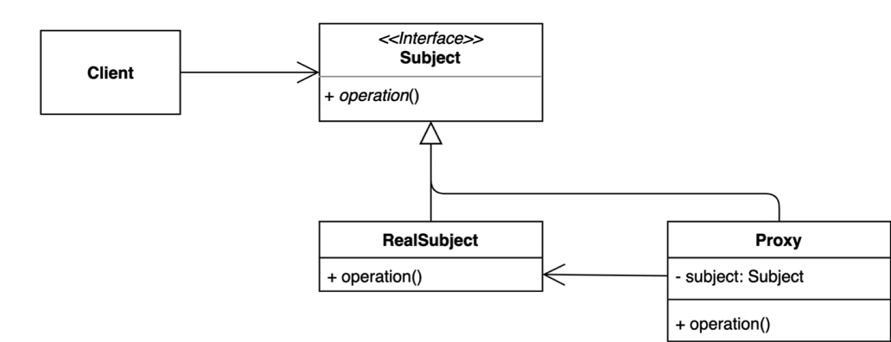

## 프록시 패턴

프록시는 사전적 의미로 대리, 대리인을 의미함  
즉 클라이언트가 어떤 특정 클래스를 쓸 때 중간 객체를 거쳐서 사용하는 패턴이라고 볼 수 있다.

프록시 패턴의 구조는 일반적으로 실제 수행할 객체를 상속받아서 해당 로직을 처리하기 전에 프록시 객체에서 특정 작업을 진행하거나
인터페이스를 활용해 상속받은 후에 실제 메인 객체를 필드로 가지는 구조가 있다.

### Before Code
```java
public class GameService {
    public void start() {
        System.out.println("게임 시작");
        try {
            Thread.sleep(1000L);
        } catch (InterruptedException e) {
            throw new RuntimeException(e);
        }
    }
}


public class Client {
    public static void main(String[] args) {
        GameService gameService = new GameService();

        gameService.start();
    }
}
```

위 코드를 건드리지 않고 실행 시간을 기록해보자

### After Code
참고로 아래에서 GameService는 위의 코드와 동일하다
**기존 코드 유지**
```java
public class GameServiceProxy extends GameService {
    @Override
    public void start() {
        long before = System.currentTimeMillis();
        super.start();
        System.out.println(System.currentTimeMillis() - before);
    }
}

public class Client {
    public static void main(String[] args) {
        GameService gameService = new GameServiceProxy();
        gameService.start();
    }
}

```
앞서 말한 것처럼 구현체만 있을 경우 해당 클래스를 상속 받아 super.메소드()를 통해 어떤 작업을 처리할 수 있다.

**인터페이스 활용**
```java
public interface GameService {
    void start();
}

public class GameServiceProxy implements GameService{
    private final GameService gameService;

    public GameServiceProxy(GameServiceImpl gameService) {
        this.gameService = gameService;
    }

    @Override
    public void start() {
        long startTime = System.currentTimeMillis();
        gameService.start();
        System.out.println("실행 시간 : " + (System.currentTimeMillis() - startTime));
    }
}

public class Client {
    public static void main(String[] args) {
        GameService gameService = new GameServiceProxy(new GameServiceImpl());
        gameService.start();
    }
}
```

### 장점
- 기존 코드를 건드리지 않고 새로운 기능 추가
  - 앞서 코드에서 기존 코드를 건드리지 않고 상속을 받고 특정 작업을 정의함
- 초기화 지연, 접근 제어, 캐싱, 로깅 등 유용하게 사용 가능

### 단점
- 코드 복잡도 증가
  - 인터페이스 없이 적용하려면 추가로 구현해야 할 것이 많아질 수 있다. 

### Java & Spring
자바에서는 런타임에 인터페이스 기반으로 프록시를 생성하며 동적 생성이 가능한 **Dynamic Proxy**라는 기능을 제공한다.
Reflection에서 Proxy.newProxyInstance 메서드와 InvocationHandler를 사용해 프록시의 동작을 정의할 수 있다.  
Spring에서는 AOP 기능을 제공하는데 이때 프록시 패턴을 활용한다. 
> Spring은 AOP Porxy를 생성하는 과정에서 자체 검증 로직을 통해 target의 인터페이스 유무를 판단한다.  
> 이때 타깃이 하나 이상의 인터페이스를 구현한다면 JDK Dynamic Proxy 방식으로 Porxy Bean을 생성하고 아니라면 CGLIB 방식으로 생성한다.  
> 